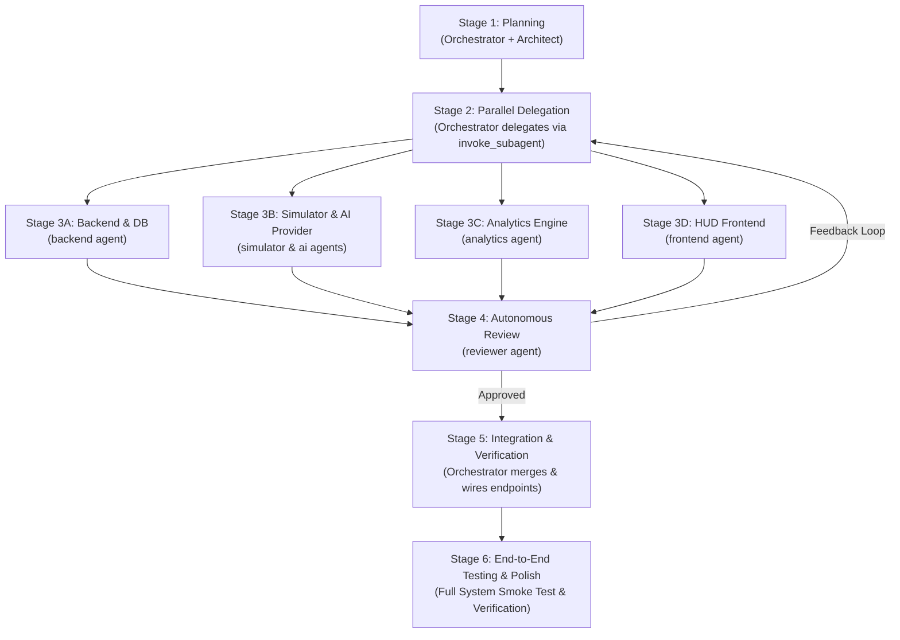

# Multi-Agent Engineering Workflow & Orchestration Protocol

## 1. Core Principles

This repository operates as a **federated multi-agent development team**.
- **The Orchestrator (Default Agent)** acts as the **Engineering Manager & Technical Coordinator**. It never writes specialized implementation code directly; its primary job is to coordinate, delegate, unblock, resolve conflicts, and maintain high-level cohesion.
- **Specialist Agents** (`architect`, `backend`, `frontend`, `simulator`, `analytics`, `ai`, `reviewer`) operate with strict autonomy within their defined directory boundaries.
- **Contract-First Engineering:** Implementation never begins without explicit interfaces and schema contracts defined by the `architect`.

---

## 2. The 6-Stage Lifecycle



---

### Stage 1: Planning
1. The Orchestrator receives the high-level objective from the User.
2. The Orchestrator engages the `architect` agent to:
   - Formulate or update the contract specification (`docs/API_SPEC.md`, `providers/base.py`, DB models).
   - Produce a decomposed, dependency-ordered work breakdown structure.
3. Once contracts are committed, the Orchestrator prepares isolated delegation prompts for specialist agents.

---

### Stage 2: Parallel Delegation
The Orchestrator launches specialist agents in parallel using the `invoke_subagent` tool.
Each subagent receives an explicit **Task Contract Packet**:
```markdown
### TASK CONTRACT PACKET
- Target Agent: backend | frontend | simulator | analytics | ai
- Objective: [Clear 1-sentence goal]
- Context: docs/ARCHITECTURE.md, docs/API_SPEC.md
- Files You Own: [Explicit list of write paths]
- Files You Must NOT Touch: [Explicit read-only boundaries]
- Pre-Conditions: [Dependencies that already exist]
- Concrete Deliverables: [Files, models, tests to create]
- Validation Criteria: [Specific terminal test command to pass]
```

---

### Stage 3: Independent Development
Specialist agents work concurrently without blocking one another because contracts were locked in Stage 1:
- **Simulator & AI Agents:** Build the city topology, vehicle kinematics, and synthetic sensor crop providers.
- **Backend Agent:** Builds database models, migrations, service layer, and REST/WebSocket infrastructure against the agreed schemas.
- **Analytics Agent:** Implements graph traversals, impossible travel physics algorithms, and plate clone heuristics using unit tests and mock data fixtures.
- **Frontend Agent:** Builds the Police HUD dashboard, GIS Leaflet map, and vehicle search UI, leveraging TypeScript interfaces matching the API contract.

---

### Stage 4: Review & Quality Audit
1. When a specialist agent finishes its task, the Orchestrator invokes the `reviewer` agent.
2. The Reviewer validates:
   - Zero placeholder code (`TODO`, `pass`, dummy constants).
   - Strict adherence to file ownership rules.
   - Code cleanliness, typing, and test coverage.
   - Absence of unhandled exceptions and performance bottlenecks.
3. If issues are found, the Reviewer outputs a structured rejection with exact line numbers and replacement snippets. The Orchestrator passes this back to the specialist agent for remediation.

---

### Stage 5: Integration & Conflict Resolution
1. Once all parallel subagents receive `APPROVED` from the Reviewer, the Orchestrator integrates the components:
   - Registers backend routers and services in `main.py`.
   - Starts the simulation loop background task.
   - Wires up the frontend API client and WebSocket listeners.
2. If merge or interface conflicts arise, the Orchestrator consults the `architect` to resolve the mismatch definitively.

---

### Stage 6: Testing & System Verification
1. Run backend unit and integration test suite:
   ```bash
   pytest backend/tests/ analytics/tests/ simulator/tests/ providers/tests/
   ```
2. Run frontend build verification:
   ```bash
   cd frontend && npm run build
   ```
3. Run end-to-end smoke test verifying:
   - Telemetry flows from Simulator -> AI Provider -> Backend Ingestion -> WebSocket -> Frontend Leaflet Map.
   - Anomaly injection triggers an instant alert notification on the dashboard.

---

## 3. Directory Ownership Matrix

| Directory / File | Architect | Backend | Frontend | Simulator | Analytics | AI | Reviewer |
|---|:---:|:---:|:---:|:---:|:---:|:---:|:---:|
| `docs/ARCHITECTURE.md` | **WRITE** | Read | Read | Read | Read | Read | Read |
| `docs/API_SPEC.md` | **WRITE** | Read | Read | Read | Read | Read | Read |
| `providers/base.py` | **WRITE** | Read | Read | Read | Read | Read | Read |
| `backend/app/models/*` | Approve | **WRITE** | Read | Read | Read | Read | Read |
| `backend/app/api/*` | Approve | **WRITE** | Read | Read | Read | Read | Read |
| `backend/app/services/*` | Read | **WRITE** | Read | Read | Read | Read | Read |
| `backend/app/websockets/*` | Approve | **WRITE** | Read | Read | Read | Read | Read |
| `frontend/src/*` | Read | Read | **WRITE** | Read | Read | Read | Read |
| `simulator/*` | Read | Read | Read | **WRITE** | Read | Read | Read |
| `analytics/*` | Read | Read | Read | Read | **WRITE** | Read | Read |
| `providers/simulator_provider.py` | Read | Read | Read | Read | Read | **WRITE** | Read |
| `providers/real/*` | Read | Read | Read | Read | Read | **WRITE** | Read |
| `docs/CODE_REVIEW_REPORTS.md` | Read | Read | Read | Read | Read | Read | **WRITE** |

---

## 4. Orchestrator Invocation Protocol

To invoke subagents during the development workflow, the Orchestrator uses the `invoke_subagent` tool.

### 4.1 Invoking a Single Specialist
```json
{
  "Subagents": [
    {
      "TypeName": "backend-engineer",
      "Role": "Senior Backend Engineer",
      "Model": "inherit",
      "Prompt": "Read your agent specification in .agents/agents/backend/agent.md.\n\nExecute Task: Implement database models for Camera, Vehicle, Detection, and Alert in backend/app/models/ as specified in docs/ARCHITECTURE.md.\n\nEnsure strict async SQLAlchemy 2.0 typing and indexes."
    }
  ]
}
```

### 4.2 Invoking Parallel Specialists Concurrently
When tasks are independent, launch them together in a single `invoke_subagent` call:
```json
{
  "Subagents": [
    {
      "TypeName": "simulator-engineer",
      "Role": "Lead Simulation Engineer",
      "Model": "inherit",
      "Prompt": "Read .agents/agents/simulator/agent.md.\n\nImplement simulator/topology.py with Delhi NCR landmark checkpoints, distances, and speed limits."
    },
    {
      "TypeName": "analytics-engineer",
      "Role": "Lead Analytics Engineer",
      "Model": "inherit",
      "Prompt": "Read .agents/agents/analytics/agent.md.\n\nImplement analytics/impossible_travel.py and analytics/plate_clone.py with unit tests in analytics/tests/."
    },
    {
      "TypeName": "ai-engineer",
      "Role": "AI Perception Interface Engineer",
      "Model": "inherit",
      "Prompt": "Read .agents/agents/ai/agent.md.\n\nImplement providers/simulator_provider.py and providers/confidence_fusion.py with SVG license plate crop synthesizer."
    }
  ]
}
```
