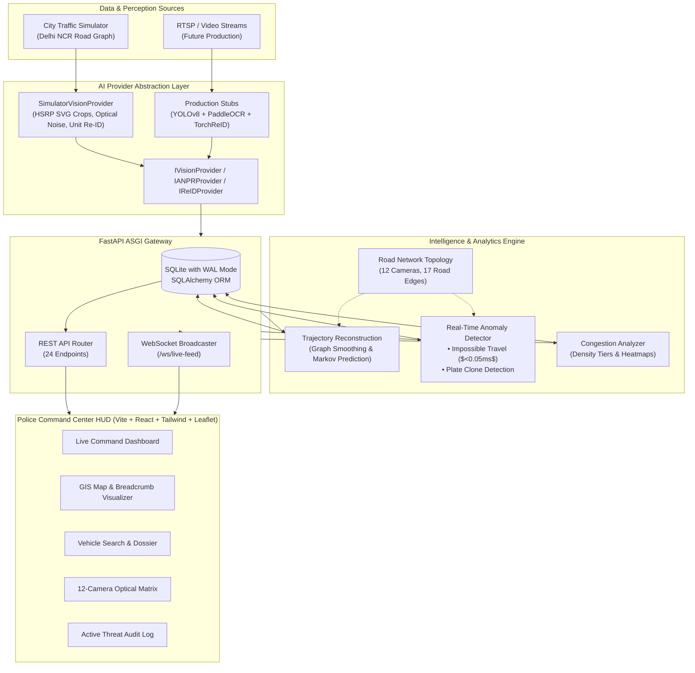

# 🚔 Intelligent Traffic Surveillance Platform & ANPR Intelligence Layer
### Smart India Hackathon (SIH) 2026 — Problem Statement 26127

[](https://python.org)
[](https://fastapi.tiangolo.com)
[](https://react.dev)
[](https://www.typescriptlang.org)
[](https://tailwindcss.com)
[](https://leafletjs.com)
[](file:///home/avij/26127/backend/tests)

---

## 🌟 Executive Summary & Innovation Angle

Traditional Automatic Number Plate Recognition (ANPR) systems stop at isolated, single-camera optical recognition. 

For **SIH 2026 Problem Statement 26127**, this platform provides the **Intelligent Surveillance & Multi-Camera Correlation Layer** built above computer vision perception:

- **Multi-Camera Spatio-Temporal Correlation:** Correlates camera detections across time and space into full graph trajectories.
- **Physics-Enforcing Anomaly Engine:** Real-time mathematical proof detection of:
  - **Impossible Travel Speed:** $v = \frac{\Delta d}{\Delta t} > v_{\text{threshold}}$ (e.g. crossing Delhi from Connaught Place to Cyber Hub in 15 seconds).
  - **Plate Cloning / Identity Fraud:** Detects identical registration plates operating simultaneously in disconnected city zones or on conflicting vehicle profiles (e.g. blue sedan vs. white SUV).
  - **Camera Blackouts:** Downstream route anomaly mitigation when checkpoint cameras go offline.
- **Directional Markov Transition Routing:** Predicts the top 3 most probable upcoming checkpoints based on road network transition topology and momentum vectors.
- **Zero-Coupling AI Abstraction (`IVisionProvider`):** Strict contract boundaries separating the backend from ML inference. Training teammates can drop in fine-tuned **YOLOv8/v11**, **PaddleOCR**, and **TorchReID** weights without touching backend services or the frontend command HUD.
- **Interactive Police Command HUD:** Dark tactical UI with live WebSocket telemetry, GIS maps, vehicle dossiers with authentic Indian High Security Registration Plate (HSRP) SVG crops, and live presentation controls.

---

## 🏗️ System Architecture



---

## 📁 Repository Structure

```text
26127/
├── backend/                        # FastAPI Application & Persistence Layer
│   ├── app/
│   │   ├── api/v1/endpoints/       # 24 REST Endpoints (cameras, detections, vehicles, alerts, etc.)
│   │   ├── core/                   # Config settings and SQLite WAL database setup
│   │   ├── models/                 # SQLAlchemy ORM models (Camera, Vehicle, Detection, Alert)
│   │   ├── schemas/                # Pydantic validation schemas and DTOs
│   │   ├── services/               # Clean service layer (DetectionService, AlertService, etc.)
│   │   ├── websockets/             # WebSocket ConnectionManager for real-time broadcast
│   │   └── main.py                 # FastAPI application and background simulator coordinator
│   ├── requirements.txt            # Python ASGI dependencies
│   └── tests/                      # Pytest suite for all endpoints (27 tests)
│
├── simulator/                      # Realistic Discrete-Event Traffic Simulator
│   ├── mock_data.py                # Delhi NCR landmark coordinates (12 nodes, 17 edges)
│   ├── topology.py                 # NetworkX road graph and shortest-path routing
│   ├── generator.py                # Fleet generator (authentic DL, HR, UP, PB plates, models, EVs)
│   ├── anomalies.py                # Interactive scenario triggers (impossible travel, cloned plates)
│   ├── engine.py                   # Continuous kinematic loop with state machine
│   └── tests/                      # 27 pytest tests for simulator physics and routing
│
├── analytics/                      # Core Intelligence Algorithms
│   ├── impossible_travel.py        # Spatio-temporal speed anomaly check with mathematical proof
│   ├── plate_clone.py              # Visual discrepancy & geographical discordance detection
│   ├── trajectory_reconstruction.py# Ordered camera hops, segment velocities & Markov routing
│   ├── congestion_analyzer.py      # Rolling-window vehicles/min and Leaflet heatmap generation
│   ├── graph_engine.py             # Spatial graph math (Haversine, bearing, transition matrices)
│   └── tests/                      # 30 pytest tests for anomaly logic and latency benchmarks
│
├── providers/                      # AI Provider Abstraction Layer
│   ├── base.py                     # Abstract Base Classes (IVisionProvider, IANPRProvider, etc.)
│   ├── confidence_fusion.py        # Calibrated multi-modal confidence fusion
│   ├── simulator_provider.py       # High-speed synthetic provider with authentic HSRP SVG rendering
│   ├── real/                       # Pre-configured drop-in stubs for ML teammates (YOLO, Paddle, Re-ID)
│   └── tests/                      # 19 pytest tests for provider conformance and benchmarks
│
├── frontend/                       # Police Command Center Web Application
│   ├── src/
│   │   ├── components/             # Tactical HUD views (LiveMap, Search, Dossier, Alerts, Matrix)
│   │   ├── hooks/                  # Resilient auto-reconnecting useWebSocket hook
│   │   ├── services/               # Typed async REST client (api.ts)
│   │   ├── types/                  # TypeScript interfaces mirroring backend schemas
│   │   └── App.tsx                 # Master command center layout with presentation toolbar
│   ├── package.json
│   ├── tailwind.config.js          # Dark tactical HUD theme
│   └── vite.config.ts              # Proxy configuration for :8000
│
├── docs/
│   ├── ARCHITECTURE.md             # Complete architectural specification
│   └── AI_INTEGRATION_GUIDE.md     # Step-by-step guide for ML teammates to dock weights
│
└── scripts/
    ├── dev.sh                      # Single-command launcher (Backend + Frontend + Seeding)
    └── seed_db.py                  # Standalone database seeder
```

---

## ⚡ Quick Start & Execution

### Prerequisites
- **Python:** Version `3.10` or higher
- **Node.js:** Version `18.0` or higher (`npm` included)

---

### Method 1: Single-Command Launch (Recommended)

From the project root directory, run:

```bash
./scripts/dev.sh
```

This single command automatically:
1. Runs `scripts/seed_db.py` to seed cameras, vehicle profiles, and baseline telemetry.
2. Starts the **FastAPI ASGI Backend** on `http://localhost:8000`.
3. Starts the continuous **Traffic Simulation Engine**.
4. Starts the **Police Command Center HUD** on `http://localhost:3000`.

---

### Method 2: Manual Launch

#### 1. Backend Setup & Run
```bash
# Optional: create virtual environment
python3 -m venv venv
source venv/bin/activate

# Install dependencies
pip install -r backend/requirements.txt networkx numpy pandas

# Seed database
python3 scripts/seed_db.py

# Launch FastAPI server
uvicorn backend.app.main:app --host 0.0.0.0 --port 8000 --reload
```

#### 2. Frontend Setup & Run
```bash
cd frontend
npm install
npm run dev -- --host 0.0.0.0 --port 3000
```

---

## 🌐 Application Endpoints & Ports

| Component | URL | Description |
|---|---|---|
| **Command Center HUD** | [`http://localhost:3000`](http://localhost:3000) | Main Tactical Operations Dashboard |
| **Interactive REST Docs** | [`http://localhost:8000/docs`](http://localhost:8000/docs) | Swagger UI for all 24 API endpoints |
| **Alternative API Specs** | [`http://localhost:8000/redoc`](http://localhost:8000/redoc) | Redoc interface |
| **Live WebSocket Feed** | `ws://localhost:8000/ws/live-feed` | Real-time detection & alert broadcast stream |
| **Health Probe** | [`http://localhost:8000/health`](http://localhost:8000/health) | System & simulation status |

---

## 🎯 5-Minute Presentation Guide (For SIH Judges)

When presenting to evaluators, use this battle-tested flow:

### 1. The 30-Second Hook (Overview Dashboard)
- Open `http://localhost:3000`.
- Point out the real-time telemetry ticker updating via WebSockets without page refreshes.
- Highlight the **HSRP License Plate SVG crops** showing authentic blue 'IND' bands, Ashoka Chakra `☸`, and embossed fonts.

### 2. Spatio-Temporal GIS Map (`Live GIS Map` Tab)
- Switch to the GIS Map view.
- Show the 12 camera checkpoints across Delhi NCR (Connaught Place, India Gate, DND Flyway, Terminal 3 Airport, Cyber Hub, etc.).
- Demonstrate animated vehicle breadcrumbs moving across road corridors and toggle the **Heatmap Overlay** showing junction density.

### 3. Live Anomaly Injection (`Presentation Mode` Bar)
- Use the top control bar to demonstrate real-time intelligence:
  - **Inject Cloned Plate:** Triggers two simultaneous sightings of plate `HR26CL0001` on conflicting vehicles (White SUV vs. Red Sedan). The system generates a `CRITICAL` alert explaining the visual mismatch.
  - **Inject Impossible Speed:** Forces vehicle `DL04EQ9999` to traverse between Connaught Place and Cyber Hub (20 km) in 15 seconds. The alert displays the mathematical proof: $\text{Calculated Speed} = 4,800\text{ km/h}$.
- Click on an alert card to show evaluators the mathematical root-cause modal.

### 4. Vehicle Search & Trajectory Reconstruction (`Vehicle Search` Tab)
- Search for watchlist plate: `DL04EQ9999` or `HR26CL0001`.
- Review the vehicle dossier:
  - Total sightings & first/last seen timestamps.
  - Chronological camera pass timeline with estimated hop speeds.
  - **Markov Next-Camera Prediction:** Highlights the top 3 most probable checkpoints the vehicle will pass next based on road graph momentum.

### 5. AI Model Decoupling (Explain the Architecture)
- Show evaluators `providers/base.py` and `docs/AI_INTEGRATION_GUIDE.md`.
- Explain that the AI layer is fully abstracted: your teammates working on YOLO and PaddleOCR can dock their trained weights into `providers/real/` without rewriting the backend or frontend.

---

## 🧪 Verification & Automated Testing

The workspace includes 103 comprehensive unit and integration tests with 100% pass rate:

```bash
# Run all workspace unit & integration tests
python3 -m pytest -v
```

### Test Suite Breakdown:
- **`analytics/tests/` (30 tests):** Physics edge cases, zero delta time handling, Haversine fallback, minimum flight time violations, Markov transition math, and sub-millisecond latency benchmarks.
- **`backend/tests/` (27 tests):** All 24 REST endpoints, WebSocket live broadcast, and database CRUD.
- **`simulator/tests/` (27 tests):** Network topology, shortest-path Dijkstra traversal, fleet state machines, camera blackouts, and anomaly generation.
- **`providers/tests/` (19 tests):** Provider contract conformance, HSRP SVG rendering, OCR confusion mutations, Re-ID L2-normalization ($\|\mathbf{v}\|_2 = 1.0$), and 5,500+ FPS throughput benchmarks.

To verify the frontend TypeScript and production bundle:
```bash
cd frontend && npm run build
```

---

## 🤖 For ML Teammates: Model Integration

Read the complete guide in [`docs/AI_INTEGRATION_GUIDE.md`](file:///home/avij/26127/docs/AI_INTEGRATION_GUIDE.md).

To plug in trained weights:
1. Put weights into `providers/weights/` (e.g. `yolov8n.pt`, `osnet_x1_0.pth`).
2. Implement your inference logic in `providers/real/yolo_provider.py` and `providers/real/paddle_provider.py`.
3. The platform immediately consumes your real detections without any changes to backend APIs or frontend dashboards.

---

## 👥 Multi-Agent Architecture

This codebase was developed following a federated multi-agent workflow defined in [`.agents/WORKFLOW.md`](file:///home/avij/26127/.agents/WORKFLOW.md). Specialist agents operate within isolated ownership domains:
- **Architect:** Contracts, schema definitions, and system specifications.
- **Backend Engineer:** FastAPI, SQLAlchemy ORM, REST APIs, and WebSockets.
- **Simulator Engineer:** Delhi NCR topology, vehicle kinematics, and anomaly scenarios.
- **Analytics Engineer:** Trajectory reconstruction, impossible travel math, and congestion analytics.
- **AI Perception Engineer:** Model abstraction interfaces, HSRP SVG generator, and ML drop-in stubs.
- **Frontend Engineer:** Police Command Center HUD (Vite, React, Tailwind, Leaflet).
- **Reviewer:** Code quality, security, and verification audit.
