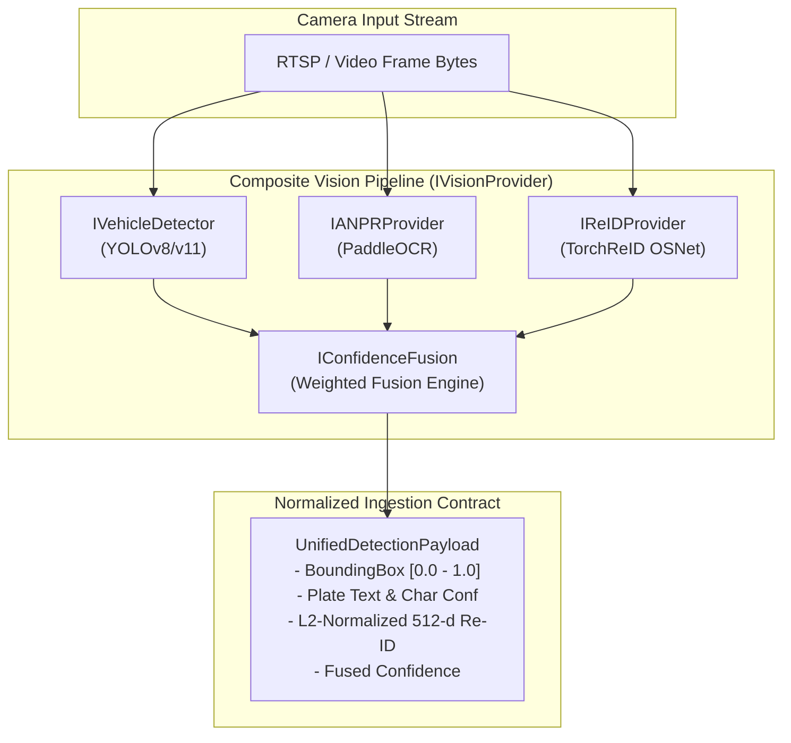

# AI Model Integration Guide (For ML & Computer Vision Engineers)

This guide documents how the Machine Learning teammate can plug trained models (**YOLOv8/v11**, **PaddleOCR**, and **TorchReID**) directly into the intelligent surveillance platform without requiring any modifications to the backend, database schemas, or frontend UI.

---

## 1. Provider Contract Architecture

The entire surveillance engine interacts with computer vision exclusively through abstract interfaces located in `providers/base.py`:
- `IVehicleDetector`: Vehicle detection and classification.
- `IANPRProvider`: License plate text recognition and character confidence scoring.
- `IReIDProvider`: Vehicle re-identification feature embedding extraction.
- `IConfidenceFusion`: Multi-modal score combination.
- `IVisionProvider`: End-to-end perception pipeline coordinating detector, OCR, and Re-ID.

The backend does **not** make direct calls to PyTorch, ONNX, Ultralytics, or OpenCV. All perception data is delivered in structured `UnifiedDetectionPayload` Pydantic models.



---

## 2. Core Data Contracts (`providers/base.py`)

All interfaces and models are strictly typed with Pydantic:

```python
from abc import ABC, abstractmethod
from datetime import datetime
from enum import Enum
from typing import List, Optional, Dict, Any
from pydantic import BaseModel, Field

class VehicleType(str, Enum):
    CAR = "CAR"
    SUV = "SUV"
    MOTORCYCLE = "MOTORCYCLE"
    AUTO = "AUTO"
    BUS = "BUS"
    TRUCK = "TRUCK"

class BoundingBox(BaseModel):
    x_min: float = Field(..., ge=0.0, le=1.0)
    y_min: float = Field(..., ge=0.0, le=1.0)
    x_max: float = Field(..., ge=0.0, le=1.0)
    y_max: float = Field(..., ge=0.0, le=1.0)

class VehicleDetection(BaseModel):
    bbox: BoundingBox
    vehicle_type: VehicleType
    confidence: float = Field(..., ge=0.0, le=1.0)
    color: str
    make_model: Optional[str] = None

class ANPRResult(BaseModel):
    plate_text: str                                  # Normalized alphanumeric string (e.g. "DL01AB1234")
    raw_text: str                                    # Raw OCR text before regex cleaning
    confidence: float = Field(..., ge=0.0, le=1.0)  # Mean plate confidence
    plate_bbox: Optional[BoundingBox] = None
    character_confidences: List[float] = Field(default_factory=list)

class ReIDEmbedding(BaseModel):
    vector: List[float] = Field(default_factory=list)  # 512-dim unit vector (||v||_2 = 1.0)
    signature_hash: str                               # Fast lookup MD5/SHA256 fingerprint
    similarity_threshold: float = 0.85

class UnifiedDetectionPayload(BaseModel):
    id: str                                          # Unique detection ID ("det_...")
    camera_id: str                                   # Camera ID ("CAM-01")
    timestamp: datetime                              # UTC capture timestamp
    detection: VehicleDetection
    anpr: ANPRResult
    reid: ReIDEmbedding
    fused_confidence: float                          # Multi-modal fused confidence [0.0 - 1.0]
    estimated_speed_kmh: Optional[float] = None
    crop_svg: Optional[str] = None
    metadata: Dict[str, Any] = Field(default_factory=dict)
```

---

## 3. Mathematical & Engineering Standards

### 3.1 L2-Normalized Embeddings for Re-ID
To enable fast similarity searches without expensive Euclidean distance operations, all Re-ID feature vectors **must be unit-normalized**:
$$\|\mathbf{v}\|_2 = \sqrt{\sum_{i=1}^{512} v_i^2} = 1.0$$

Under unit-normalization, the cosine similarity between two vehicle sightings $\mathbf{u}$ and $\mathbf{v}$ simplifies to the dot product:
$$\text{CosineSimilarity}(\mathbf{u}, \mathbf{v}) = \mathbf{u} \cdot \mathbf{v} = \sum_{i=1}^{512} u_i v_i$$

### 3.2 Multi-Modal Confidence Fusion
Confidence scores from different sensor channels are fused using `WeightedConfidenceFusion`:
$$\text{Score} = \frac{w_{\text{det}} \cdot C_{\text{det}} + w_{\text{anpr}} \cdot C_{\text{anpr}} + w_{\text{reid}} \cdot C_{\text{reid}}}{w_{\text{det}} + w_{\text{anpr}} + w_{\text{reid}}}$$

Default calibrated weights:
- **ANPR Confidence ($w_{\text{anpr}}$)**: `0.55` (Plate text correctness is primary)
- **Vehicle Detection Confidence ($w_{\text{det}}$)**: `0.35` (Object classifier)
- **Re-ID Consistency ($w_{\text{reid}}$)**: `0.10` (Appearance match)

---

## 4. How to Plug In Real Models

Drop-in stubs have been pre-created in `providers/real/`:

### Step 1: Vehicle Detection (YOLOv8 / YOLOv11)
File: `providers/real/yolo_provider.py`
1. Place trained weights in `providers/weights/` (e.g. `yolov8n.pt` or custom fine-tuned `best.pt`).
2. Implement model inference in `YOLOv8VehicleDetector.detect`:
   ```python
   # Load image from frame bytes
   import cv2, numpy as np
   frame = cv2.imdecode(np.frombuffer(frame_bytes, np.uint8), cv2.IMREAD_COLOR)
   results = self.model(frame)
   ```
3. Map detected class indices to `VehicleType` (e.g. `CAR`, `SUV`, `BUS`, `TRUCK`, `MOTORCYCLE`, `AUTO`).

### Step 2: Automatic Number Plate Recognition (PaddleOCR)
File: `providers/real/paddle_provider.py`
1. Initialize `PaddleOCR` instance in `load_model()`.
2. Crop the plate region from the bounding box or full frame and run:
   ```python
   result = self.ocr.ocr(plate_crop, cls=self.use_angle_cls)
   ```
3. Return `ANPRResult` with normalized text and character confidences.

### Step 3: Vehicle Re-Identification (TorchReID)
File: `providers/real/reid_provider.py`
1. Load `osnet_x1_0` or `osnet_ain_x1_0` weights.
2. In `extract_features()`, compute embedding:
   ```python
   features = self.extractor(vehicle_crop)
   norm = torch.norm(features, p=2, dim=1, keepdim=True)
   unit_vec = (features / norm).squeeze().tolist()
   ```

### Step 4: Activating Real Models in Backend
In `backend/app/core/config.py` (or through environment variable `VISION_PROVIDER`):
```python
VISION_PROVIDER = "providers.real.yolo_paddle_provider.YoloPaddleVisionProvider"
```

No changes are required in:
- The SQLite / PostgreSQL database tables.
- The Trajectory Reconstruction and Anomaly Detection engines.
- The WebSocket live broadcasting feed.
- The Leaflet GIS Command Center UI.

---

## 5. Testing & Verification

Run the test suite to verify provider implementations:
```bash
pytest providers/tests/ -v
```

All implementations must satisfy:
1. **Conforming Payloads**: All outputs match `UnifiedDetectionPayload`.
2. **Zero Framework Leakage**: Core modules run cleanly without requiring GPU/CUDA or heavy ML frameworks.
3. **High Throughput**: Simulation provider achieves $> 50\text{ fps}$ on standard CPU hardware.
