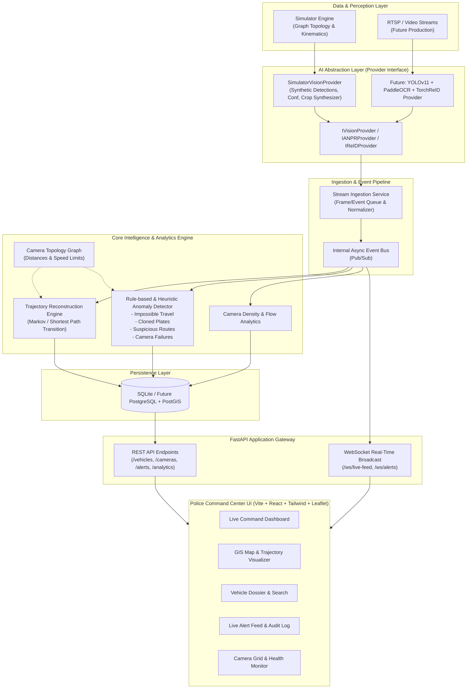

# SIH 2026 (Problem Statement 26127) - System Architecture & Engineering Specification

**Project Title:** Intelligent Traffic Surveillance Platform & ANPR Intelligence Layer  
**Role:** Principal Software Architect & Technical Lead  
**Scope:** Internal Round MVP → Investor/Judge Demonstration → Modular Production Path  

---

## 1. Project Analysis & Core Strategy

### 1.1 The Problem & The Innovation Angle
Traditional traffic monitoring systems focus narrowly on Automatic Number Plate Recognition (ANPR) or standalone camera feeds. For SIH 2026 Problem Statement 26127, **our core innovation is not building an OCR model from scratch**, but building the **Intelligent Surveillance & Multi-Camera Correlation Layer**:
- **Multi-Camera Spatio-Temporal Correlation:** Correlating detections across camera networks over time to reconstruct full trajectory graphs.
- **Real-Time Anomaly Engine:** Detecting physics-defying anomalies (e.g. impossible travel speed between distant nodes), cloned/duplicate plates active simultaneously, missing checkpoint detections, and suspicious loitering/circuitous routing.
- **Interactive GIS Command Center:** Police command center UX displaying live camera telemetry, animated trajectories, speed estimations, predictive next-camera routing, and vehicle dossier deep-dives.
- **Zero-Coupling AI Abstraction:** A strict abstraction boundary separating ingestion/analytics from inference models, allowing immediate drop-in replacement of the simulation engine with fine-tuned YOLOv8, PaddleOCR, and TorchReID models without touching the backend or frontend.

---

## 2. High-Level System Architecture



---

## 3. Directory Structure

```text
26127/
├── backend/
│   ├── app/
│   │   ├── api/
│   │   │   ├── v1/
│   │   │   │   ├── endpoints/
│   │   │   │   │   ├── alerts.py
│   │   │   │   │   ├── analytics.py
│   │   │   │   │   ├── cameras.py
│   │   │   │   │   ├── detections.py
│   │   │   │   │   ├── search.py
│   │   │   │   │   ├── simulator.py
│   │   │   │   │   └── vehicles.py
│   │   │   │   └── router.py
│   │   │   └── websockets/
│   │   │       ├── connection_manager.py
│   │   │       └── events.py
│   │   ├── core/
│   │   │   ├── config.py
│   │   │   ├── database.py
│   │   │   └── security.py
│   │   ├── models/
│   │   │   ├── alert.py
│   │   │   ├── camera.py
│   │   │   ├── detection.py
│   │   │   └── vehicle.py
│   │   ├── schemas/
│   │   │   ├── alert.py
│   │   │   ├── analytics.py
│   │   │   ├── camera.py
│   │   │   ├── detection.py
│   │   │   └── trajectory.py
│   │   │   └── vehicle.py
│   │   ├── services/
│   │   │   ├── anomaly_service.py
│   │   │   ├── camera_service.py
│   │   │   ├── search_service.py
│   │   │   ├── trajectory_service.py
│   │   │   └── vehicle_service.py
│   │   └── main.py
│   ├── requirements.txt
│   └── tests/
│
├── simulator/
│   ├── __init__.py
│   ├── config.py
│   ├── engine.py                  # Continuous event loop & vehicle clock
│   ├── generator.py               # Fleet generator, plates, colors, vehicle profiles
│   ├── topology.py                # Road network graph, camera distances, adjacency
│   ├── anomalies.py               # Scenarios: cloned plate, impossible speed, camera blackouts
│   └── mock_data.py               # Seed data for city coordinates, camera landmarks
│
├── providers/
│   ├── __init__.py
│   ├── base.py                    # ABC: IVisionProvider, DetectionResult, ANPRResult
│   ├── simulator_provider.py      # Simulator adapter fulfilling ABC
│   └── real/                      # Plug-and-play future modules for teammate
│       ├── __init__.py
│       ├── yolo_provider.py       # Stubs ready for YOLOv8 weights
│       ├── paddle_provider.py     # Stubs ready for PaddleOCR
│       └── reid_provider.py       # Stubs ready for TorchReID feature vectors
│
├── analytics/
│   ├── __init__.py
│   ├── graph_engine.py            # NetworkX graph for spatio-temporal road transitions
│   ├── impossible_travel.py       # Physics checks: distance / elapsed_time > speed_threshold
│   ├── plate_clone.py             # Simultaneous or geographically discordant sightings
│   ├── trajectory_reconstruction.py
│   └── congestion_analyzer.py     # Rolling window vehicles/min per camera
│
├── frontend/
│   ├── index.html
│   ├── package.json
│   ├── vite.config.ts
│   ├── tailwind.config.js
│   ├── tsconfig.json
│   └── src/
│       ├── assets/
│       ├── components/
│       │   ├── common/            # Badges, Cards, Buttons, StatusIndicators, Modal
│       │   ├── dashboard/         # LiveMetrics, CameraGridPreview, RecentAlerts, MiniFeed
│       │   ├── map/               # LeafletMap, CameraMarker, TrajectoryPolyline, HeatmapOverlay
│       │   ├── search/            # PlateSearchBox, FilterBar, MatchResultCard
│       │   ├── vehicle/           # DossierHeader, TimelineView, CameraPassList, NextCamPrediction
│       │   └── alerts/            # AlertCard, SeverityFilter, RootCauseExplainer
│       ├── context/               # WebSocketContext, FilterContext
│       ├── hooks/                 # useWebSocket, useDetections, useCameras, useAlerts
│       ├── layouts/               # MainLayout, Header, Sidebar, CommandStatusBar
│       ├── pages/                 # Dashboard, VehicleSearch, VehicleDetails, MapView, Cameras, Analytics, Alerts, Settings
│       ├── services/              # api.ts, ws.ts
│       ├── types/                 # TypeScript interfaces mirroring backend schemas
│       └── utils/                 # formatters, geo, date, colors
│
├── docs/
│   ├── ARCHITECTURE.md
│   ├── API_SPEC.md
│   └── AI_INTEGRATION_GUIDE.md    # Guide for teammate to plug in real AI models
│
└── scripts/
    ├── dev.sh                     # Launch both backend & frontend concurrently
    ├── seed_db.py                 # Pre-populate cameras and initial historical logs
    └── run_tests.sh
```

---

## 4. API Design Specification

### 4.1 REST API Endpoints

#### Camera Management (`/api/v1/cameras`)
- `GET /api/v1/cameras` : List all cameras with status (ACTIVE, DEGRADED, OFFLINE), coordinates, zone, speed limit.
- `GET /api/v1/cameras/{camera_id}` : Specific camera metadata and 24h traffic statistics.
- `POST /api/v1/cameras/{camera_id}/status` : Toggle camera status (simulate blackout/maintenance).

#### Detection Stream (`/api/v1/detections`)
- `GET /api/v1/detections/recent?limit=50&camera_id=&plate=` : Live telemetry list with OCR confidence, timestamp, bounding box, vehicle type.
- `GET /api/v1/detections/{detection_id}` : Full detection detail including synthetic crop preview URL and Re-ID embedding hash.

#### Vehicle Dossier & Trajectory Search (`/api/v1/vehicles`)
- `GET /api/v1/vehicles/search?q=DL01AB1234&fuzzy=true&vehicle_type=SUV` : Plate fuzzy search and attribute search.
- `GET /api/v1/vehicles/{plate_number}` : Vehicle master profile (first seen, last seen, total sightings, flag status).
- `GET /api/v1/vehicles/{plate_number}/trajectory` : Chronological ordered camera sequence, GPS path points, estimated speed between hops, predicted next camera.
- `GET /api/v1/vehicles/{plate_number}/alerts` : Any anomalies flagged for this vehicle.

#### Anomaly & Alert Engine (`/api/v1/alerts`)
- `GET /api/v1/alerts?severity=HIGH&status=ACTIVE&type=IMPOSSIBLE_TRAVEL` : List system alerts with comprehensive "Why it occurred" root cause explanation.
- `PATCH /api/v1/alerts/{alert_id}/acknowledge` : Mark alert acknowledged/investigating by operator.

#### City Traffic Analytics (`/api/v1/analytics`)
- `GET /api/v1/analytics/overview` : Total vehicles tracked today, active cameras, alert count, avg network speed.
- `GET /api/v1/analytics/congestion` : Congestion index per camera / junction heatmap points.
- `GET /api/v1/analytics/hourly-flow` : Time-series breakdown of detections by vehicle classification (Car, Bike, Bus, Truck).

#### Simulator Controls (`/api/v1/simulator`)
- `POST /api/v1/simulator/start` | `POST /api/v1/simulator/pause` : Start/pause simulation tick.
- `POST /api/v1/simulator/speed?multiplier=1.0` : Set time compression (1x, 2x, 5x).
- `POST /api/v1/simulator/inject-anomaly` : Trigger specific demo scenarios (e.g. `CLONED_PLATE`, `HIGH_SPEED_CHASE`, `CAMERA_BLACKOUT`).

### 4.2 Real-Time WebSocket Protocol (`/ws/live-feed`)
Client connects to `ws://localhost:8000/ws/live-feed`.
All messages are JSON framed with standard envelope:
```json
{
  "event": "NEW_DETECTION" | "NEW_ALERT" | "CAMERA_STATUS_CHANGED" | "METRICS_UPDATE",
  "timestamp": "2026-09-09T14:40:00.000Z",
  "data": { ... }
}
```

---

## 5. Database Schema (SQLite / SQLAlchemy)

### 5.1 Tables
1. **`cameras`**:
   - `id` (VARCHAR PK, e.g. `CAM-01`)
   - `name` (VARCHAR)
   - `latitude` (FLOAT)
   - `longitude` (FLOAT)
   - `zone` (VARCHAR: e.g. "Connaught Place", "Airport Expressway")
   - `speed_limit_kmh` (FLOAT)
   - `status` (VARCHAR: `ACTIVE`, `OFFLINE`, `MAINTENANCE`)
   - `fps` (INTEGER)

2. **`vehicles`**:
   - `plate_number` (VARCHAR PK, normalized)
   - `vehicle_type` (VARCHAR: `CAR`, `SUV`, `TRUCK`, `BIKE`, `BUS`)
   - `color` (VARCHAR)
   - `make_model` (VARCHAR)
   - `first_seen_at` (DATETIME)
   - `last_seen_at` (DATETIME)
   - `is_flagged` (BOOLEAN)
   - `flag_reason` (VARCHAR, nullable)

3. **`detections`**:
   - `id` (VARCHAR PK / UUID)
   - `camera_id` (VARCHAR FK -> `cameras.id`)
   - `plate_number` (VARCHAR FK -> `vehicles.plate_number`)
   - `ocr_plate_text` (VARCHAR, raw OCR output)
   - `ocr_confidence` (FLOAT, 0.0 - 1.0)
   - `vehicle_type` (VARCHAR)
   - `vehicle_color` (VARCHAR)
   - `reid_embedding_hash` (VARCHAR, mock feature vector fingerprint)
   - `timestamp` (DATETIME, indexed)
   - `synthetic_crop_svg` (TEXT, lightweight inline SVG / stylized plate snapshot)
   - `speed_kmh` (FLOAT, estimated speed at checkpoint)

4. **`alerts`**:
   - `id` (VARCHAR PK / UUID)
   - `alert_type` (VARCHAR: `IMPOSSIBLE_TRAVEL`, `PLATE_CLONE`, `CAMERA_OFFLINE`, `SUSPICIOUS_ROUTE`, `LOW_CONFIDENCE`)
   - `severity` (VARCHAR: `LOW`, `MEDIUM`, `HIGH`, `CRITICAL`)
   - `plate_number` (VARCHAR, nullable)
   - `camera_id` (VARCHAR, nullable)
   - `details` (JSON / TEXT: explanation, mathematical proof e.g. "Distance: 18.4km, Time: 90s, Calculated Speed: 736 km/h")
   - `status` (VARCHAR: `ACTIVE`, `ACKNOWLEDGED`, `RESOLVED`)
   - `created_at` (DATETIME, indexed)

5. **`camera_topology_edges`**:
   - `from_camera_id` (VARCHAR FK)
   - `to_camera_id` (VARCHAR FK)
   - `distance_km` (FLOAT)
   - `avg_travel_time_sec` (FLOAT)
   - `min_physically_possible_sec` (FLOAT, used for impossible travel calculation)

---

## 6. Simulator Engine Architecture

The Simulator is designed as a discrete-event, graph-based traffic generator:
1. **Spatial Topology:** A directed road network with 10–15 key city checkpoints (Connaught Place, India Gate, DND Flyway, Ring Road, Terminal 3, Cyber Hub, etc.).
2. **Fleet Kinematics:** 40–80 active vehicles navigating realistic paths using Dijkstra/A* pathing along topology edges.
3. **Vehicle Behavior Models:**
   - *Regular Commuters:* Obey speed limits (30–80 km/h) with natural Poisson arrival intervals.
   - *Taxis/Delivery:* Continuous high-frequency traversals across inner-city rings.
   - *Synthetic Noise:* 5% OCR errors (e.g., '0' misread as 'O', '8' as 'B'), dirty plates with confidence drops.
4. **Interactive Anomaly Injection for Judges:**
   - **Cloned Plate Demo:** Vehicle with plate `DL-01-AX-9921` triggers Cam A, and within 45 seconds triggers Cam J (25 km away in a different district). The Anomaly Engine flags dual active vectors.
   - **Impossible Speed Demo:** Vehicle hits Cam C at 14:02:00 and Cam D (10 km away) at 14:03:00 (600 km/h calculated speed).
   - **Camera Blackout:** Simulated failure of critical intersection camera, rerouting alerts to upstream cameras.

---

## 7. AI Provider Abstraction Interface

Strict contract decoupling AI models from the rest of the software stack:

```python
from abc import ABC, abstractmethod
from typing import List, Optional
from pydantic import BaseModel
from datetime import datetime

class BoundingBox(BaseModel):
    x_min: float
    y_min: float
    x_max: float
    y_max: float

class RawDetection(BaseModel):
    bbox: BoundingBox
    class_name: str
    confidence: float
    crop_image_base64_or_svg: Optional[str] = None

class ANPRResult(BaseModel):
    plate_text: str
    confidence: float
    plate_bbox: Optional[BoundingBox] = None

class ReIDEmbedding(BaseModel):
    embedding_vector: List[float] # Normalized 512-d or hash for similarity
    signature_hash: str

class UnifiedDetectionPayload(BaseModel):
    camera_id: str
    timestamp: datetime
    vehicle_detection: RawDetection
    anpr: ANPRResult
    reid: ReIDEmbedding
    estimated_speed: Optional[float] = None

class IVisionProvider(ABC):
    """Abstract Interface for Computer Vision Processing.
    Allows Seamless Swapping between Simulator and Real PyTorch/YOLO/Paddle Models.
    """
    @abstractmethod
    async def process_frame(self, camera_id: str, frame_data: bytes) -> List[UnifiedDetectionPayload]:
        """Runs object detection, license plate recognition, and Re-ID on a camera frame."""
        pass

    @abstractmethod
    async def generate_telemetry_event(self) -> UnifiedDetectionPayload:
        """Used by SimulatorProvider to generate physically realistic telemetry frames."""
        pass
```

---

## 8. Step-by-Step Implementation Roadmap

| Step | Milestone | Deliverable |
|---|---|---|
| **Phase 1** | **System Architecture & Contracts** *(Current)* | Complete architecture design, API specs, schemas, and provider contracts. |
| **Phase 2** | **Backend Core & Database Scaffold** | FastAPI app, SQLite database tables, SQLAlchemy models, Pydantic schemas, initial camera seeds. |
| **Phase 3** | **AI Provider & Traffic Simulator** | Camera graph topology, fleet generator, simulator engine, synthetic crop generator, event stream. |
| **Phase 4** | **Analytics & Anomaly Engine** | Multi-camera trajectory builder, impossible travel detector, plate clone detector, congestion metrics. |
| **Phase 5** | **REST APIs & WebSocket Broadcast** | Real-time endpoint hooks, WebSocket connection manager, manual anomaly trigger APIs for demo. |
| **Phase 6** | **Frontend Scaffold & Dark Command UI** | Vite + React + TailwindCSS, responsive dark command center layout, police ops HUD theme. |
| **Phase 7** | **Command Center Views** | Live Dashboard, GIS Map with Leaflet trajectories, Vehicle Search & Dossier, Alerts Center, Camera Matrix. |
| **Phase 8** | **End-to-End Verification & Presentation Polish** | 1-click startup script, demo guide for judges, automated anomaly showcase, docs for AI teammate. |
